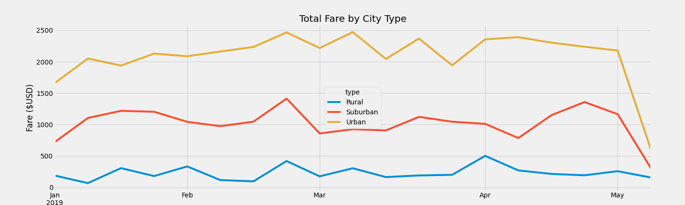

# Ride Share Analysis

### Overview of Analysis
The purpose of this project is to provide management with a summary of data from a ride-sharing data set.  The analysis of the ride-sharing data will be conducted using Pandas and Matplotlib to create a multiple line-graph that shows the total weekly fares for each city type.  The goals is to provide insight on how the data differs by city type and how any differences can be used by decision makers. 

### Analysis 1
The first technical analysis looks at ride-sharing data by city type and includes a summary of the data.

#### Results
This analysis looked at the ride-sharing summary dataframe by city type.  It used `groupby` function, `count` and `sum` methods on dataframe columns to get the total number of rides, total number of drivers and total fares for each city type. Then the average fair per ride and average fare per driver for each city type was obtained. 

The graphic below summarizes the data by the three city types: Rural, Suburban and Urban.

### Analysis 2
The second technical analysis looked at ride-sharing data of total fares by city type and includes a summary of the data.

#### Results
This analysis looked at the ride-sharing data for total fare by city type.  It used `grouppby()` function,= as well as `pivot()` and `resample()` functions on dataframe columns to get the total fares by city type.  A dataframe was created using the `loc` fucntion on a date range to show the sum of the fares by week.  

The graphic below summarizes the total fares by city type. 

### Summary
The following summarizes the differences in ride-sharing data among the different city types.  Rid-sharing data included the total rides, total drivers, total fares, average fare per ride and driver, and totla faire by city type. 

#### Summary Results
Based on the analysis of the ride-sharing data provided, the following recommendations to management regarding any disparities among city types include the following: 

* Urban fares are higher than both suburban and rural fares.  These average 4x higher than rural fares for the period assessed. It is recommended to increase fares for rural and suburban ride types.

* The rides for rural areas are 10x lower than urban and 5x lower than suburban rides.  It is recommen ded to increse drivers for rural and suburban to capture possible opportunities.

* The average fare per ride and per driver is highest in rural city types.  While hte urban city type average fares are 20% to 50% lower than rural.  It is recommended that urban faires be increased to capture increased fares and normalize total drivers counts.
